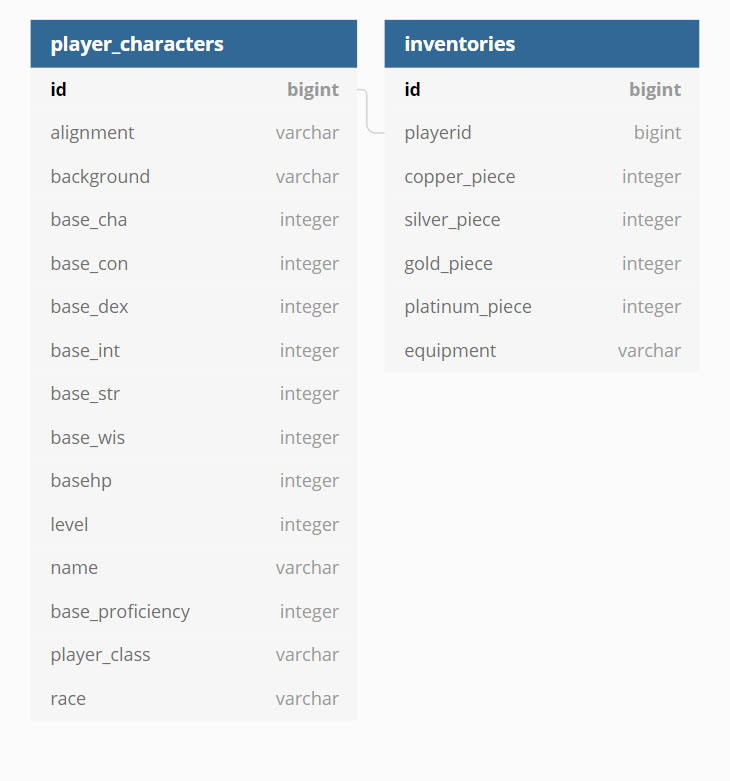

# DND Character Sheet Application -

In fulfilment of the solo project assignment for QA Consulting

## Index
[Brief](#brief)
   * [Solution](#solution)

[Architecture](#architecture)

[Testing](#testing)

[Deployment](#deployment)

[Front End Design](#frontend)
   * [Plan 1](#fep1)
   * [Plan 2](#fep2)
   * [Final Appearence](#fefa)

[Future Improvments](#improvements)

## The Brief
To create an OOP-based application making use of supporting tools, methodolgies and technologies that demonstrate all of the core modules covered over the training period.
The application must manipulate two tables with full CRUD functionality.

### Solution
For my project I decided to create an application that would allow the user to create dnd characters, edit, view and remove them from a database, there would be separate databases for certain details of the characters such as the race and class.

## Architecture
### Entity Relationship Diagrams
#### Initial plan
Though in my initial plan I intended to create a number of tables for different aspects of DnD characters; Classes, Races etc as noted on my trello, I only managed to create two tables with some relational aspects as shown in the diagram below

#### Delivered Solution

### Multi Tier Architecture Diagram
Click for higher res version

## Testing
JUnit, Mockito and Selenium tests were used for automated testing, Codacy was used to check code quality throughout the project for both the front and backend.

## Deployment
The build test, deployment and selenium tests were all automated through the use of jenkins with the backend this was done through the use of a jenkins file and with the front end this was done with a normal jenkins job. This application can be succesfully deployed both locally and on GCP, there is a globals.js file which contains constants for changing the location of the http requests 

## Front End Design
### Wireframes

### Plan 1 Wireframe (One Page)

#### Plan 1 - Outline
The plan here would be to have all the interaction on a single page using the fields to both display information of a given character, edit and delete it by using the top most dropdown to either select an existing or new character. The user might also need to write in a characters name to verify that they wanted to delete it (as on one page like this it would be easier for it to be done accidentally)

### Plan 2 Wireframe (2 Page)
#### Create and Edit Page

#### View and Delete Page (Possibility 1)

#### Plan 2 - Outline
The plan here would be to maintain the ability to edit existing and create new on the first page, but then break out the viewing and deleting into a separate page so to make this more separated. The second page has been marked Possiblity 1 as the other possiblity is instead having a similar layout to the create and edit page where the dropdown just shows uneditable information in a similar layout

### Final Appearance

## Future Improvements
